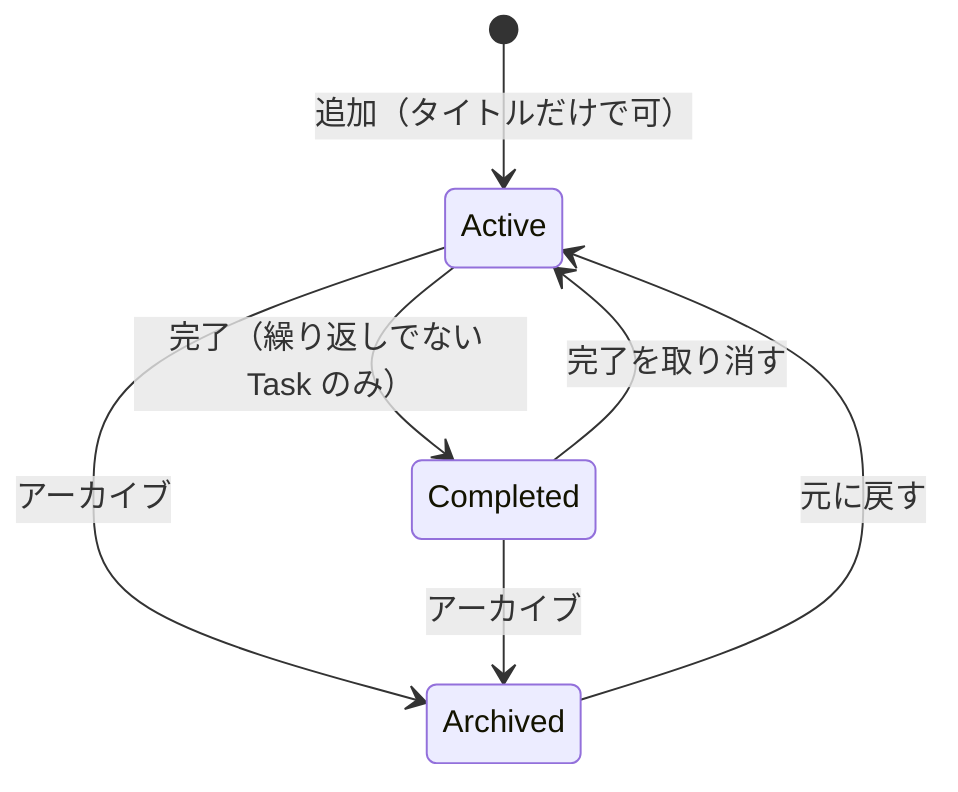
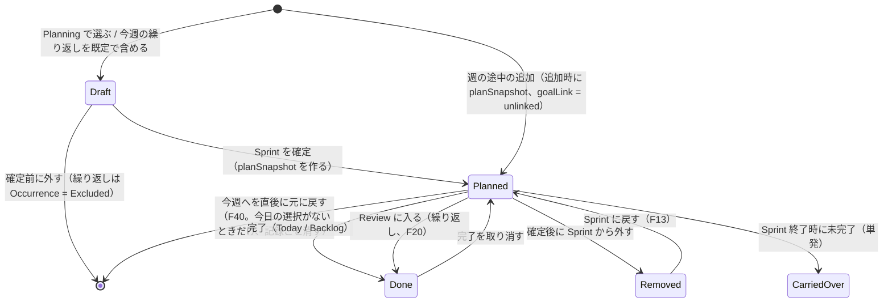
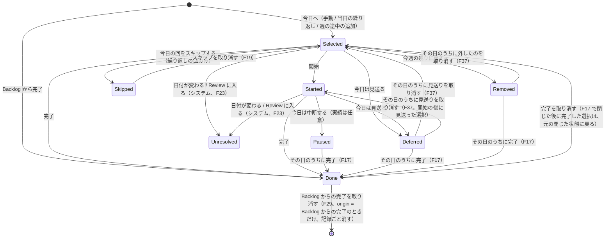
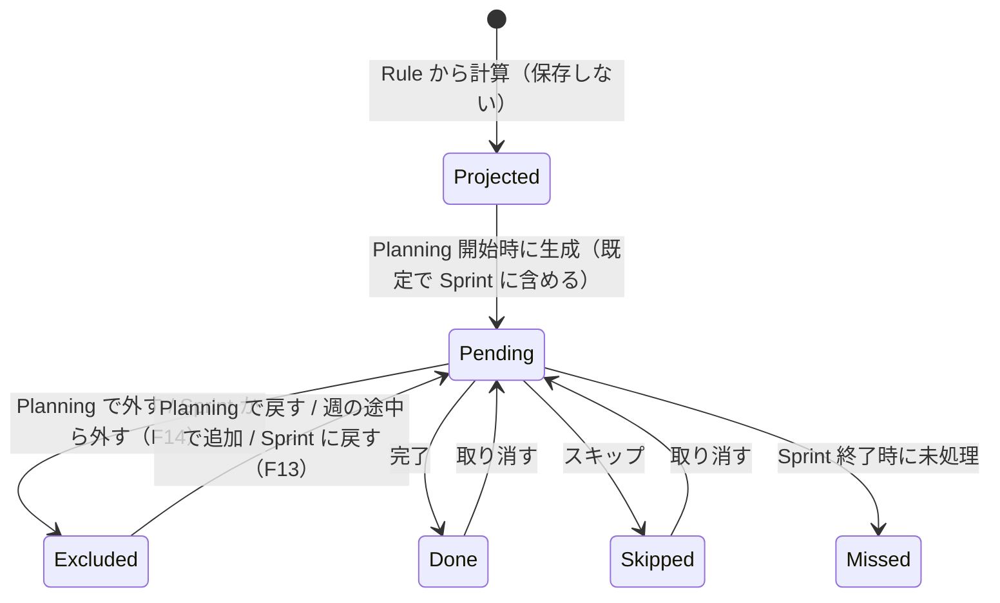
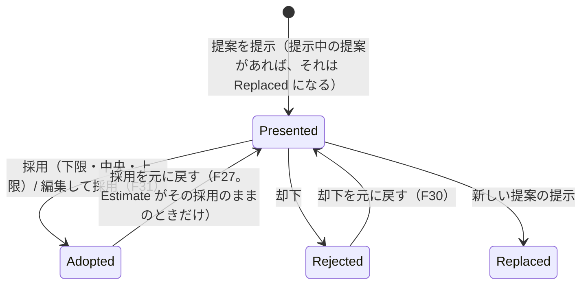
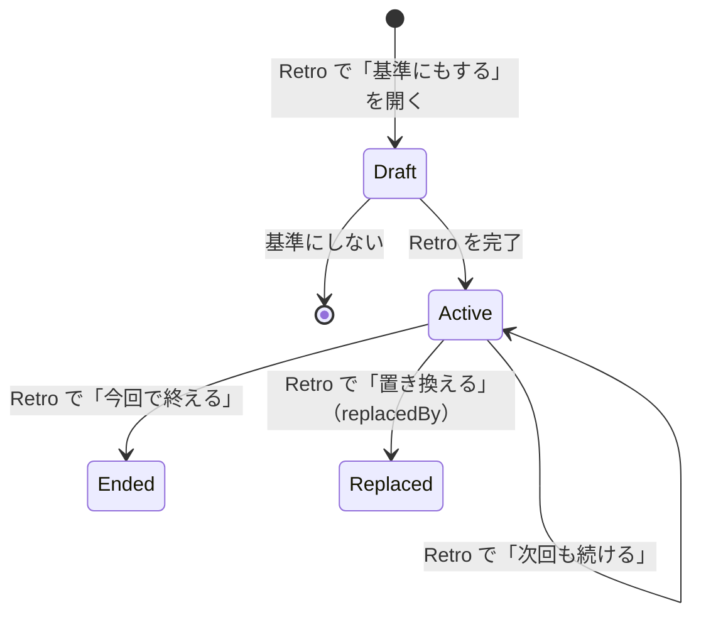
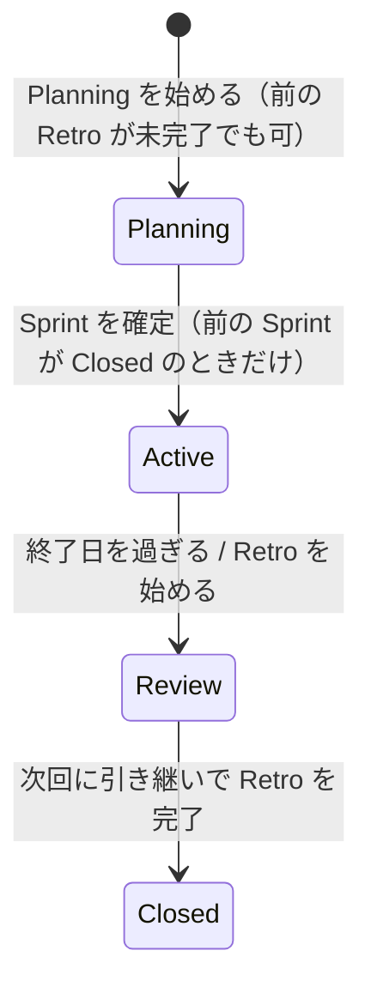

# Personal Sprint ドメインモデル v0.2 Final

Sep 26, 2026 · @van

## 目的と前提

v0.2 Final は v0.1 の骨格（恒久的な **Task** と、「この Sprint で」「この日に」「この回で」の記録を分ける）を保ち、UI 間の 13 論点への決定と 3 つの修正、さらに v0.2 で出た 6 論点への決定を反映した版です。新しい画面や機能は加えていません。

**このモデルの 5 つの柱**

1. Task は **User に属する**恒久の Entity。Backlog は所属先ではなく、lifecycle = active の Task を並べた**ビュー**。Sprint への参加は **SprintTask**、日ごとの選択は **DailySelection**、繰り返しの 1 回は **Occurrence**。
2. Goal は **SprintGoal**（Sprint × Area）。Task は Goal を持たず、関係は SprintTask.goalLink（linked / unlinked）にだけある。
3. 時間は **Estimate**（本人）・**EstimateSuggestion**（提案）・**PlanningValue**（今回の計画値）の 3 つ。「提案を採用して Estimate にする」と「計画基準を適用して計画値を作る」は別の操作。
4. **RetroImprovement**（文）と **PlanningCriterion**（ルール）は別物。Sprint で基準をどう扱ったかは **CriterionUse** に残す。
5. 後から変えられる値（Goal の文、使える時間、Area 名）は **Sprint 確定時に写し取り**、変更は履歴として残す。Sprint の画面はその Sprint の間、写し取った Area 名で固定する。操作の「いつ・誰が」は **Activity** に追記する。

### v0.1 からの変更

| # | 決定 | モデルへの反映 | UI への影響 |
| --- | --- | --- | --- |
| 1 | 今週発生する繰り返しは既定で Sprint に含める | Planning 開始時に期間内の Occurrence を生成し、SprintTask（Draft）を作る。外した回は Occurrence = Excluded | Planning：繰り返しは選択済みで始まり、外せる |
| 2 | 生成済みの回は Rule 変更で動かさない | 新しい版は次の Sprint の Planning で生成する回から効く | Backlog：変更時に「次の Sprint から反映」と書く |
| 3 | 進行中に「今日は中断する」 | DailySelection = Paused。未完了でも ActualTime を任意で追記 | Today：進行中の行に追加 |
| 4 | 日付変更まで未処理の選択は unresolved | システムが Unresolved にし、連続見送りに数えない | なし |
| 5 | 確定後の基準 OFF は扱わない | CriterionUse から disabledAt を削除 | Retro：「途中で使わなくなった」表示を削除 |
| 6 | 確定時に適用しなかった Sprint も Retro で決める | Active な基準があれば必ず CriterionUse を作り、retroDecision を必須に | Retro：未適用でも決定欄を出す |
| 7 | 週の途中の追加にも基準を当てる | 追加時点で planSnapshot を作る。基準は確定時に適用したときだけ当てる。容量警告は出さない | Today / Backlog：超過表示なし |
| 8 | 週の途中の追加は Goal に自動で紐付けない | role を goalLink（linked / unlinked）に変更。追加は unlinked | 表記「目標に入っている / 入っていない」（Issue #205） |
| 9 | 「今日は見送る」と「今週の残りに戻す」を分ける | DailySelection = Deferred / Removed。Removed は見送りに数えない | Today：操作を 2 つに |
| 10 | Backlog からの完了を Sprint にも反映 | SprintTask = Done、当日の DailySelection（Done）を作る | Today：「済んだもの」に出る |
| 11 | 持ち越しは自動で次に入れない | 次の Sprint の候補に出すだけ。選ばれたら carriedFrom | なし（v0.1 のまま） |
| 12 | 前 Retro 未完了でも draft は可、確定は不可 | Sprint 確定の前提条件に「前の Sprint が Closed」 | Planning：確定ボタンに理由を添えて無効化 |
| 13 | 確定後も Goal と使える時間は変更可 | 確定時の値を写し取り、変更を履歴に残す | Retro：確定したときとの差を表示 |
| 修正 | Task は User に属する | Backlog は active Task のビュー | なし |
| 修正 | Area 名を写し取る | Sprint 確定時に SprintAreaSnapshot | Sprint の画面は確定時の名前で表示 |
| 修正 | 採用と適用を分ける | 下の「用語」を参照 | Backlog / Planning のボタン文言を変更 |

### v0.2 Final で決めたこと

F7〜F9 は v0.2 Final の後、2026-09-27 に決めた（Issue #18）。F10・F11 は同じ日に、`packages/domain` の実装で見つかった食い違いについて決めた（Issue #20）。F12 も同じ日に決めた（Issue #21）。F13〜F16 も同じ日に、Sprint と Planning の実装で出た境界の場合について決めた（Issue #22）。F17〜F19 も同じ日に、Today の実装で出た境界の場合について決めた（Issue #23）。F20〜F24 も同じ日に、Review と Retro の実装で出た境界の場合について決めた（Issue #24）。F25〜F27 も同じ日に、Backlog の画面の実装で出た表示と操作について決めた（Issue #39）。F28・F29 も同じ日に、Backlog の実装の後に残った点について決めた（Issue #47）。F30・F31 は 2026-09-28 に、Agent 提案の操作について決めた（Issue #40、決定 4A）。F32 も同じ日に、Today の画面の実装で出た数え方について決めた（Issue #41）。F33 は 2026-09-29 に、過去の日の取り消しについて決めた（Issue #53）。F34 も同じ日に、Sprint の開始日より前の Backlog からの完了について決めた（Issue #59）。F35・F36 は 2026-09-30 に、実行中の Sprint の週のうちに次の Sprint を計画したときの持ち越しについて決めた（Issue #89）。F37 は 2026-10-01 に、Today の見送り・外すの取り消しについて決めた（Issue #101、決定シート B12=B）。F38 も同じ日に、記録した割り込みを直す・消すことについて決めた（Issue #102、決定シート B13=A）。F39 も同じ日に、まだ効き始めていない Rule の版を変えることについて決めた（Issue #192）。F40 も同じ日に、今日を選ばずに今週に足す操作の取り消しについて決めた（Issue #155）。F41 も同じ日に、繰り返しをやめることについて決めた（Issue #189）。F42 も同じ日に、選んだ Task に効かない計画基準の確定時の扱いについて決めた（Issue #162）。

| # | 決定 | モデルへの反映 | UI への影響 |
| --- | --- | --- | --- |
| F1 | Active な Sprint 中の Rule 変更は次の Sprint から | 新しい版は、まだ確定していない次の Sprint から効く（effectiveFrom = その Sprint の開始日）。確定済みの Sprint の回と SprintTask は変えない（draft が生成済みの回は F7） | Backlog：変更時に「次の Sprint から反映」 |
| F2 | Excluded は通常の Retro 事実に出さない | Occurrence = Excluded は記録に残す。Retro の事実は Sprint に含めた回だけから派生させる | Retro：外した回は表示しない |
| F3 | 週の途中の追加への基準は確定時の適用に従う | 追加時の planSnapshot は、CriterionUse.appliedAtConfirm = true のときだけ基準を当てる | なし |
| F4 | 連続見送りは選んだ機会で数える | 同じ Task の DailySelection を日付順に並べ、Deferred の連続を数える。選ばなかった日は無視し、Paused / Done / Removed で途切れる | Today：「N回続けて見送り」 |
| F5 | Sprint の画面は確定時の Area 名 | Planning / Today / Retro は SprintAreaSnapshot の名前、Backlog など恒久側は現在の名前 | 改名は次の Sprint から Sprint の画面に反映 |
| F6 | Paused は翌日に自動で入れない | 「昨日の続き」は派生（前日の DailySelection = Paused）。DailySelection は本人の「今日へ」で作る | Today：「昨日の続き」として候補の上に出す |
| F7 | 次の Sprint の draft が回を生成した後の Rule 変更は、未確定の回を作り直す | 新しい版は、まだ確定していない次の Sprint から効く。draft がすでに回を生成していれば、その Task の回（Pending / Excluded）と SprintTask（Draft）を捨て、新しい版の回を既定どおり Sprint に含めて作り直す。draft で外した選択は引き継がない。確定済みの Sprint の回は変えない（不変条件 31） | Backlog の「次の Sprint から反映」がそのまま正しくなる |
| F8 | 連続見送りは Unresolved を無視し、Skipped で途切れる | Unresolved は選ばなかった日と同じく、数えず途切れさせない。繰り返しの回の Skipped は本人の決定なので、Done・Removed と同じく連続を途切れさせる（不変条件 23） | なし |
| F9 | Sprint 中に初めて現れた Area は、その時点の名前を写し取る | SprintAreaSnapshot にない Area が Sprint 中に初めて現れたとき（その Area の Task を Sprint に追加した、または Sprint 内の Task の Area にした）、その時点の名前を並び順の末尾に足して固定する（不変条件 18） | その Sprint の Today / Retro では、その Area も名前が固定される |
| F10 | 計画基準はサブタスク合計に作用しない | Subtask の見積もりは点の値なので、サブタスク合計も点になる。不変条件 9 の「幅のあるサブタスク合計」を削除 | なし |
| F11 | 一部のサブタスクが見積もりなしなら、その件数を示す | timeBasis がサブタスク合計のとき、見積もりのあるサブタスクだけを足し、見積もりのないサブタスクの件数を PlanningValue に持つ。すべて見積もりなしなら、その Task が見積もりなし（不変条件 8） | Planning：「2.5h（サブタスク 1件は見積もりなし）」のように合計と件数を並べる |
| F12 | 毎週の繰り返しは曜日を複数指定できる | RecurrenceRule の版の曜日は 1 つ以上（例：毎週 月・木）。その Sprint で発生する回は指定した曜日の数（1〜7 回） | Backlog・Planning：「毎週 月・木」のように曜日を並べる |
| F13 | Sprint から外した Task は同じ Sprint に戻せる | SprintTask に Removed → Planned（Sprint に戻す）を足す。同じ SprintTask を戻すので「同じ Sprint に 1 件まで」（不変条件 14）は保たれ、origin と planSnapshot は変わらない | 確定後に外した Task を元に戻せる |
| F14 | 繰り返しの SprintTask を外すと、残りの回は外した回になる | Sprint 中に Removed にすると、その SprintTask の Pending の回を Excluded にする（完了・スキップ済みの回はそのまま）。Today に出ず、Retro の事実（未処理）にも出ない（F2）。F13 で戻すと Pending に戻る | なし |
| F15 | Planning 中に作った Rule は、その draft の週にも回を作る | まだ確定していない次の Sprint が Planning 中なら、Rule を作ったときにその期間の回を生成し、既定で Sprint に含める（F7 と同じ考え方）。その draft で同じ Task を単発として選んでいたら、繰り返しの SprintTask に置き換える（持ち越しのつながりと Goal への紐づけは引き継がない） | Planning：作った繰り返しがすぐに「今週の繰り返し」に出る |
| F16 | 確定後の Goal は、文を変えることと新しく書くことができ、消すことはできない | 確定後に新しく書いた Goal は plannedText を持たない（計画時にはなかった）。確定後は Goal を消さない | Retro：確定後に書いた Goal は「確定したときにはなかった」として差分に出る |
| F17 | 「今日は中断する」「今日は見送る」「今週の残りに戻す」にした選択も、その日のうちなら完了にできる | DailySelection に Paused / Deferred / Removed → Done（同じ日のうち）を足す。Today でも Backlog からの完了でも、その日の選択を Done にする（2 件目は作らない。不変条件 21・27）。見送りだった選択が Done になると、連続見送りはそこで途切れる（見送った事実は Activity に残る）。同じ日に選び直す（2 件目の選択を作る）ことはできない（見送り・外すの取り消しは F37）。この完了を取り消すと、元の閉じた状態（見送りなど）に戻る | Today：閉じた行にも「完了」を出せる。Backlog の「完了にする」がその日も通る |
| F18 | 繰り返しの回は、同じ Sprint のほかの日にも「今日へ」選べる | 予定日と違う日の DailySelection を作れる（前倒し・後ろ倒し）。前倒しで済ませた回は予定日に Done なので、当日の繰り返しとして Today に出ない | Today：今週の残りの繰り返しから選べる |
| F19 | 繰り返しの回のスキップは取り消せる | DailySelection に Skipped → Selected（スキップを取り消す）を足す。回は Skipped → Pending に戻る（完了の取り消しと同じ扱い） | Today：スキップした行に「取り消す」を出す |
| F20 | 繰り返しの SprintTask は Review で Done として閉じる | 回を束ねた SprintTask は、Review に入ると Done にする（持ち越しにしない。結果は回ごとの Done / Skipped / Missed に残る）。次の Sprint は自分の回を生成する | Retro：繰り返しは「完了・持ち越し」ではなく、回の数で見せる |
| F21 | Retro は最終日から始められる | 本人は Sprint の最終日から「Retro を始める」で Review に入れる。終了日を過ぎたら、システムが Review にする | Today：最終日に「Retro を始める」を出す |
| F22 | Review 中も実績時間を後から足せる | ActualTime は Sprint が Active か Review の間に追記できる。Closed になったら足せない | Retro：事実を見ながら「かかった時間を記録」で足せる |
| F23 | Review に入るときの未処理・Missed はシステムが付ける | 本人が最終日に Retro を始めた場合も、開いたままの DailySelection の Unresolved と、未処理の Occurrence の Missed は、システムの記録（actor = システム）として付ける。不変条件 24 に Review への移行を加える | なし |
| F24 | Sprint から外した繰り返しの、外す前に済ませた回も Retro の事実に出す | 外す前に完了・スキップした回は Retro の事実（完了・スキップ）に出す。外したときに Excluded になった残りの回は出さない（F2・F14） | Retro：途中で外した繰り返しも、やった回は見える |
| F25 | Sprint の番号は作成順の通し番号 | 「Sprint 14」の番号は保存せず、本人の Sprint を作成順に並べた位置（1 から）として派生させる。Sprint は重ならず、新しい Sprint はそれまでのどの Sprint よりも後に始まる（不変条件 11）ので、作成順は開始日の順と同じで、番号は変わらない | 持ち越し「（Sprint 13から）」、Sprint Header の「Sprint 14」 |
| F26 | 持ち越し回数は、持ち越しから選び直した後も数える | Task の持ち越し回数は、最新の SprintTask の carriedFrom の連なりの数に、その SprintTask 自身が CarriedOver なら 1 を足したもの（派生）。持ち越しから選び直して今の Sprint にある間も回数を保つ。持ち越しを使わずに選び直すと 0 から数え直す | Backlog：切り口「持ち越し」は回数が 1 以上の Task。行に「持ち越し N回（Sprint M から）」 |
| F27 | 提案の採用は、直後に元に戻せる | EstimateSuggestion に 採用 → 提示中（採用を元に戻す）を足す。Estimate を採用前の値（なければ空）に戻し、Activity に残す。Estimate がその採用のままで、ほかに提示中の提案がないときだけ（提示中は 1 つまで） | Backlog・Planning の Task 詳細：採用後の 1 行に「元に戻す」 |
| F28 | 今日を含む Sprint がない日の「期限が近い」は、その週の終わりまで | 「期限が近い」は今日から今日を含む Sprint の終わりまで（#39 のオーナー決定）。Review に入った日や最初の Sprint の前など、今日を含む Sprint がない日は、User の週の始まりから数えたその週の終わりまでとする（派生） | Backlog：Retro の日にも「期限が近い」が空にならない |
| F29 | Backlog からの完了は、直後に元に戻せる | Backlog の「完了にする」を取り消すと、完了前の状態に戻す。Task は Active に、今の Sprint の SprintTask は Planned に戻る。完了の操作で作った今日の選択（origin = Backlog からの完了）は、完了前には無かったので記録ごと消す。完了前からあった選択は、完了の取り消しと同じく元の状態（Selected、または F17 で閉じていた状態）に戻す。完了と取り消しは Activity に残る | Backlog：完了した行の位置に「完了にしました」の 1 行と「元に戻す」を残す（Toast にはしない） |
| F30 | 提案の却下は、直後に元に戻せる | EstimateSuggestion に 却下 → 提示中（却下を元に戻す）を足す。ほかに提示中の提案がないときだけ（提示中は 1 つまで）。Estimate は却下で変わらないので、戻しても変わらない。Activity に残す | Backlog・Planning の Task 詳細：却下後の 1 行に「元に戻す」 |
| F31 | 提案は、値を直してから採用できる（編集して採用） | 提示中の提案から、本人が直した値を Estimate にする。Estimate.source は「提案を編集して採用」で、元の提案を指す（下限・中央・上限のどれでもない）。提案は採用になる。値は幅の外でもよい（本人の値なので）。F27 と同じく直後に元に戻せる | Backlog・Planning の Task 詳細：Agent 提案に「直して使う」（Quiet。Issue #206） |
| F32 | 「今週の完了」は、繰り返しを回で数える | 派生（`weekProgress`）。繰り返しでない Task は 1 件（今週から外したものと持ち越しは数えない）、繰り返しは今週の回を 1 件ずつ数える（Planning で外した回とスキップした回は数えない。Missed は数える）。完了は Done の Task と Done の回。保存しない。点数にしない | Today：上部の Progress「今週の完了 N / M件」。実行中の Sprint の画面：Sprint Header の下に同じ Progress（Sprint の画面は実行中の Sprint を開いたときだけ） |
| F33 | 過去の日の完了・スキップは、Sprint 中なら取り消せる。取り消した日は未処理になる（F17・F29 の場合を除く） | 本人が完了の取り消し（Done → Selected、F17 で閉じていた選択は元の閉じた状態）かスキップの取り消し（Skipped → Selected、F19）をし、同じ操作の中でシステムが、過ぎた日の開いた選択を Unresolved にする（不変条件 24）。Backlog からの完了で作った選択は、F29 と同じく記録ごと消す。Task は Active・SprintTask は Planned に、回は Pending に戻る。Sprint が Review に入った後は取り消せない。取り消しと Unresolved は Activity に残る | Sprint（実行中）：「日ごとの記録」に昨日までの完了・スキップと「取り消す」 |
| F34 | Sprint の開始日より前でも、今週の Task は Backlog から完了にできる | 確定済みで開始日前の Sprint にある Task を Backlog で完了にすると、Task は Completed、SprintTask は Done になる。選ぶ日がまだないので DailySelection は作らない（不変条件 27 の例外）。直後の取り消しでは Task は Active、SprintTask は Planned に戻る（F29）。Sprint 外の Task を「今日へ」入れるのは開始日から | Backlog：開始日前は「今日へ」を無効にし、始まる日を添える |
| F35 | 次の Sprint で先に選んだ Task は、前の Sprint が Review に入るときに持ち越しとしてつなぐ | Sprint N が Review に入るとき、次の Sprint（Planning 中）に同じ Task の単発の SprintTask（Draft、carriedFrom なし）があり、N の SprintTask が CarriedOver になるなら、その draft に carriedFrom（N の SprintTask）を付ける。本人が選んだ Task に後からつなぐだけで、次の Sprint に入れることではないので、不変条件 20 には当たらない。記録の主体はシステム（F23 と同じ扱い）で、Activity に残す。N の週の途中に次の Sprint で選んでも、N の Review 後に「持ち越し」から選んだ場合と同じつながりと回数になる | Planning：実行中の Sprint にまだ完了していない Task は、候補の行に「Sprint N で進行中」と出す（選ぶことは止めない） |
| F36 | 持ち越し回数は、まだ確定していない draft を数えない | F26 の「最新の SprintTask」から、Planning 中の Sprint の Draft を除く（派生）。次の Sprint の draft で選んでも、確定するまでは今までの SprintTask で数える。持ち越しを使わずに選び直したときの数え直し（F26）は、その Sprint を確定したときから効く | Backlog・Planning：実行中の Sprint の週に次の Sprint で選んでも「持ち越し N回（Sprint M から）」が消えない |
| F37 | 「今日は見送る」「今週の残りに戻す」は、その日のうちなら取り消せる | DailySelection に Deferred → Selected / Started と Removed → Selected（同じ日のうち）を足す。同じ選択を開いた状態に戻す（2 件目は作らない。不変条件 21）。戻る先は閉じる前の状態で、開始してから見送った選択は Started に戻り、開始時刻を残す（オーナーの確認待ち：開始後に見送った選択の取り消しで Started に戻すのは推奨案 A として実装した）。翌日以降は取り消せない（過ぎた日の見送り・外すはそのまま記録に残る）。連続見送りは取り消した後の状態で数える（不変条件 23）ので、取り消した見送りは数えない。見送り・外すと、その取り消しは Activity に残る。「今日は中断する」の取り消しは含めない | Today：見送った行に「取り消す」。今週の残りに戻したものは「今週の残り」の「今日へ」で戻る（Issue #233） |
| F38 | 割り込みは、Sprint が実行中の間は直せる・消せる | InterruptNote の text と minutes を直せる（minutes は消してもよい。at は記録した時刻のまま）。InterruptNote を消せる。消した直後は元に戻せる（同じ id・at・text・minutes で元の位置に戻す。at が今より後のもの、at の日付（利用者のタイムゾーン）が Sprint の期間の外のもの、利用者のほかの Sprint の割り込みと同じ id のものは戻さない）。割り込みを記録するときも、記録する時刻の日付（利用者のタイムゾーン）が Sprint の期間の内にあるときだけとする（戻すときと同じ範囲。確定した Sprint は開始日より前でも実行中だが、その間は記録できない）。どれも Sprint が実行中の間だけで、Review に入った後は固定する（Retro の事実を Retro で編集しない、不変条件 40）。直した・消した・元に戻したことは Activity に残る。Today・Retro の割り込みは今の記録から出すので、直した内容が出て、消したものは出ない | Today：割り込みの各行の `…` に「編集」「消す」。編集は記録と同じ面。消すと Toast「割り込み「メモ」を消しました」と「元に戻す」 |
| F39 | まだ効き始めていない版を変えるときは、版を増やさずに置き換える | 最新の版の effectiveFrom が新しい版と同じ（まだ効き始めていない）なら、新しい版を足さず、最新の版の型を置き換える。置き換えた型が 1 つ前の版と同じなら、最新の版を消し、1 つ前の版の effectiveTo を外して版を戻す。どちらも Activity に Rule の変更として残す（版は置き換えた版、戻したときは戻った先の版）。効き始めた版は変えない（不変条件 31）。draft が生成済みの回は F7 のとおり作り直す | Backlog：選ぶたびに保存しても、版は次の Sprint の分の 1 つだけ増える |
| F40 | 今日を選ばずに今週に足した Task（今週へ）は、直後に元に戻せる | 今週へは、今日の選択を作らない週の途中の追加（origin = midSprint、goalLink = unlinked、planSnapshot は追加時、容量の警告なし）。元に戻すと、その SprintTask を記録ごと消す（SprintTask に Planned → [*] を足す）。Task は Sprint 外に戻るので、もう一度今週へ・今日へ入れられる（不変条件 14）。SprintTask が Planned のままで、その SprintTask を選んだ DailySelection がないときだけ。今日へ（SprintTask と DailySelection を同時に作る、不変条件 26）は取り消さない。追加で SprintAreaSnapshot に足した Area はそのまま（F9）。追加と取り消しは Activity に残す | Backlog：行の `…` と Task の詳細に「今週へ」。Toast「「タイトル」を今週に入れました」と「元に戻す」 |
| F41 | 繰り返しをやめると、まだ確定していない次の Sprint から回を作らず、Task はその後単発になる。回を 1 つも作っていない Rule は外して単発の Task に戻す | 本人が「繰り返しをやめる」と、Rule の最新の版に effectiveTo（まだ確定していない次の Sprint の開始日の前日）を入れ、Rule を Task から外す（Rule は taskId で Task を指したまま残る）。その日より後に効き始める版（まだ効き始めていない版）は消す（F39 と同じ考え方）。その Sprint の Planning（draft）が回を生成していれば、その Task の回（Pending / Excluded）と SprintTask（Draft）を捨てる（F7 と同じく、F15 で置き換えた単発の選択は戻さない）。確定済みの Sprint の回と SprintTask は変えない（不変条件 31）。Task と過去の回の記録は残る。effectiveTo までは今までどおり繰り返しとして扱う（その Sprint の回は Today で回ごとに完了し、Backlog からは完了にも今日へにもできない）。effectiveTo より後の Sprint では単発の Task として扱う（Planning で選べ、完了できる。もう一度繰り返しにもできる）。やめた Rule は変えられず、もう一度やめることもできない。draft の回を捨てた後に Rule の回が 1 つも残らない（作ったばかり）なら、Rule を消し、すぐに単発に戻す。どちらも Activity に残す（やめた版と最後の日、または Rule を外したこと） | Backlog の Task 詳細：繰り返しの欄に「繰り返しをやめる」。最後の日までは行を「毎週 土 · 次は 10/3 (土) · 10/4 (日) まで」と出して切り口「繰り返し」に残し、過ぎたら行の ○ が戻る。外したときはすぐ ○ が戻る |
| F42 | 選んだ Task に効かない計画基準は、確定時に適用しない | 確定時に、Check で使うとしていても、基準が当たった計画値（幅のある提案から、基準の対象の Area で作った計画値）が 1 件もなければ、CriterionUse.appliedAtConfirm = false にする。CriterionUse はできる（不変条件 36）。週の途中の追加にも基準は当たらない（F3） | Planning：対象がなければ基準を出さない（Issue #161）。週の途中に足した幅のある Task にも当たらない |

### 用語

| 画面の言葉 | モデル | 意味 |
| --- | --- | --- |
| Estimate（本人） | Estimate | 本人が確定した点の値。Task に残り、次の Sprint でも使う |
| 提案 | EstimateSuggestion | 製品側の幅。未確定 |
| 提案を**採用**する | Estimate.source = 提案から採用（または提案を編集して採用、F31） | 「上限 5h を Estimate にする」。提案の値を直してから Estimate にするのが「編集して採用」。Task の値が永続的に変わる。Backlog と Planning のタスク詳細で行う |
| 計画値 | PlanningValue | この Sprint の時間判断に使う値。Task は変わらない |
| 計画基準を**適用**する | CriterionUse.appliedAtConfirm | 「今回は上限で計画する」。提案の幅から計画値を作る。Planning の Check で行う |
| 今日は見送る | DailySelection = Deferred | 今日はやらないと決めた。「N回続けて見送り」に数える |
| 今週の残りに戻す | DailySelection = Removed | 選び直し。見送りに数えない |
| 今日は中断する | DailySelection = Paused | 進めたが未完了。実績を任意で残せる。翌日は「昨日の続き」として候補に出る |
| 持ち越し | SprintTask = CarriedOver | Sprint 終了時に未完了 |
| スキップ | Occurrence / DailySelection = Skipped | 繰り返しの回だけ |

**対象外**：DB 製品、テーブル、API、認証、フレームワーク、Event Sourcing の採否、ID 形式。

## Domain Map

Task は User に属し、Backlog はそのうち active なものを並べたビューです。Sprint とのつながりはすべて SprintTask を通り、Today の選択も Task ではなく SprintTask を指します。

&#91;embedded content: ドメインマップ · 恒久（Backlog）・期間（Sprint / Today）・学び（Retro）\]

- **恒久（User の持ち物）**：Area、Task とその持ち物（Subtask、Estimate / Suggestion、RecurrenceRule、Occurrence）、PlanningCriterion。Sprint が終わっても残る。Backlog は lifecycle = active の Task のビューで、独立した入れ物ではなく、Area は現在の名前で表示する。RecurrenceRule の変更は、まだ確定していない次の Sprint から効く。
- **期間（Sprint）**：Sprint が SprintGoal、SprintTask、DailySelection、InterruptNote、SprintAreaSnapshot（確定時の Area 名。Sprint 中に初めて現れた Area はその時点の名前）を持つ。Planning / Today / Retro はその Sprint の間、SprintAreaSnapshot の名前で Area を表示する。使える時間と Goal の文は、確定時の値と現在の値の両方を持つ。
- **学び（Retro）**：Retro は 1 つの Sprint を振り返り、ReflectionNote と RetroImprovement を持つ。Improvement から任意で PlanningCriterion を作り、次の Sprint での扱いが CriterionUse になる。Retro が完了するまで、次の Sprint は確定できない。
- 図にはないが、すべての操作は **Activity**（いつ・誰が・何を）として追記される。外部 Agent の計画案は **PlanProposal** として Sprint の Planning 中だけ存在する。

## Entity / Value Object 一覧

記録として持つのは 22 概念で、Backlog は保存しないビューです。「持ち越し回数」「連続見送り」「Retro の事実」「計画時との差分」「昨日の続き」は保存せず、記録から派生させます。E = Entity、VO = Value Object。

| 概念 | 何を表すか | 主な属性 | 所有・参照 | 履歴として残すもの |
| --- | --- | --- | --- | --- |
| User（E） | 利用者。恒久の概念すべての持ち主 | 表示名、タイムゾーン、週の始まり | — | — |
| Area（E） | 仕事・研究など、ユーザー定義の領域 | 名前、色、並び順、アーカイブ | User | 名前の変更。Sprint の画面（Planning / Today / Retro）は SprintAreaSnapshot の名前、Backlog は現在の名前で表示 |
| Task（E） | 恒久的な「やること」 | title、description、area（任意）、due（任意）、priority（高 / 通常 / 低）、lifecycle（active / completed / archived）、timeBasis（親 / サブタスク合計） | User。Area を参照。Subtask・Estimate・Suggestion・Rule を所有 | 作成日時と作成元（Backlog / Today / Agent）、属性の変更、完了・アーカイブ |
| Backlog（ビュー） | lifecycle = active の Task の一覧 | 領域の絞り込み、切り口、検索 | 保存しない | — |
| Subtask（E） | Task の中の手順 | title、estimate（任意）、done | Task | 完了日時 |
| Estimate（VO） | 本人が確定した点の値 | hours、setAt、source（手入力 / 提案を採用：下限・中央・上限 / 提案を編集して採用：元の提案、F31） | Task（現在値は 1 つ） | 値の変更履歴 |
| EstimateSuggestion（E） | 製品側の提案（幅） | lo–hi、根拠、不確実な点、createdAt、state（提示中 / 採用 / 却下 / 置換） | Task | すべて残す |
| RecurrenceRule（E・版つき） | 繰り返しの決まり | 版ごとに freq（毎日 / 平日 / 毎週 / 毎月）、曜日（毎週は 1 つ以上）・日付、effectiveFrom、effectiveTo | Task（0..1。やめた Rule は Task から外れ、Task を指したまま残る：F41） | 版そのもの。新しい版は、まだ確定していない次の Sprint から効く（effectiveFrom = その Sprint の開始日）。まだ効き始めていない版は、足さずに置き換える（F39）。その Sprint の Planning（draft）がすでに回を生成していれば、その回を作り直す。やめると最新の版に effectiveTo を入れて Task から外し、回を 1 つも作っていなければ Rule を消す（F41） |
| Occurrence（E） | ルールから発生した 1 回 | scheduledDate、ruleVersion、materializedAt、state（Pending / Excluded / Done / Skipped / Missed） | Task（Rule の版を参照） | 状態と日時。Sprint の確定後は Rule 変更の影響を受けない（未確定の draft の回は作り直す）。Excluded は記録に残すが、通常の Retro 事実には出さない |
| Sprint（E・集約の根） | 期間の計画単位（MVP は 1 週） | start、end、state、confirmedAt、availableHours（確定時 / 現在）、previousSprint | User | 使える時間の変更履歴、確定日時、状態遷移 |
| SprintAreaSnapshot（VO） | その Sprint での Area の表示名。その Sprint の Planning / Today / Retro はこの名前を使う | area、name、order | Sprint | 確定時に固定。Sprint 中に初めて現れた Area は、その時点の名前を並び順の末尾に足して固定 |
| SprintGoal（E） | Sprint × Area の「今週どうなっていたいか」 | area、plannedText（確定時）、text（現在）、selfAssessment（できた / 一部できた / できなかった / 判断しない / 未判定） | Sprint。Area を参照 | 確定後の文の変更履歴、自己判定 |
| SprintTask（E） | Task をこの Sprint で扱うこと（参加レコード） | task、occurrences（繰り返しのみ）、origin（planning / midSprint）、addedAt、goalLink（linked / unlinked）、planSnapshot、outcome、carriedFrom | Sprint。Task・Occurrence を参照 | 追加の日時と経路、goalLink の変更、計画値、結果（例外：今週へを直後に元に戻すと記録ごと消える。F40。追加と取り消しは Activity に残る） |
| PlanningValue（VO） | 今回の時間判断に使う値 | lo、hi、base（Estimate / 提案 / サブタスク合計 / なし）、unestimatedSubtasks（サブタスク合計のとき、見積もりのないサブタスクの件数）、criterionApplied、computedAt | SprintTask の planSnapshot | 作成時に固定（計画分は確定時、追加分は追加時） |
| DailySelection（E） | ある日に、ある SprintTask（またはその回）を「今日やる」と選んだこと | date、origin（手動 / 当日の繰り返し / 週の途中の追加 / Backlog からの完了）、selectedAt、startedAt、resolution（Done / Paused / Deferred / Removed / Skipped / Unresolved）、resolvedAt、closedBefore（F17：その日に閉じた後に完了したとき、元の閉じた状態と日時） | Sprint。SprintTask・Occurrence を参照 | すべて残す（例外：Backlog からの完了で作った選択は、その完了を取り消すと消える。F29。完了と取り消しは Activity に残る） |
| ActualTime（VO） | 任意の実績時間 | hours、date、via（完了時 / 中断時 / 後から）、recordedAt | SprintTask（繰り返しは Occurrence） | 追記のみ。合計がその Sprint の実績 |
| InterruptNote（E） | 予定外の出来事のメモ。Task ではない | at、text、minutes（任意） | Sprint | Sprint が実行中の間は text と minutes を直せる・消せる（F38）。Review に入った後は固定。記録・直す・消す・元に戻すは Activity に残る |
| PlanningCriterion（E） | Estimate の幅を計画値にするルール | scope（すべて / 特定の Area）、rangePolicy（下限 / 中央 / 上限）、sourceImprovement、state（Draft / Active / Ended / Replaced）、replacedBy | User。Improvement を参照 | 作成・継続・終了・置換 |
| CriterionUse（E） | ある Sprint でその基準をどう扱ったか | criterion、appliedAtConfirm（適用した / しなかった。週の途中の追加もこれに従う）、retroDecision（続ける / 終える / 置き換える） | Sprint。Criterion を参照 | 確定時の適用と Retro での決定 |
| Retro（E） | Sprint の振り返り | startedAt、completedAt、pins（気になる印）、ReflectionNote（VO・自然文） | Sprint と 1 対 1 | 完了日時（次の Sprint を確定できる条件）、印 |
| RetroImprovement（E） | 次の Sprint で 1 つ変えてみること（自然文） | text、derivedCriterion（0..1） | Retro（1 件） | 文、次回 Planning で表示した事実 |
| PlanProposal（E） | 外部 Agent の計画案（差分） | source、createdAt、項目ごとの採否 | Planning 中の Sprint | 項目ごとの採否 |
| Activity（記録） | 「いつ・誰が・何をしたか」の追記専用ログ | at、actor（本人 / Agent / システム）、kind、対象 | 各概念 | 追記のみ |

**補足**

- 「今日へ追加」は Task の状態変更ではなく、DailySelection の作成。`today = true` のようなフラグは持たない。
- Subtask の時間の数え方（timeBasis）は **Task に属する**。Planning 確定時にその値を SprintTask の planSnapshot に写し取る。
- 繰り返し Task の SprintTask は、その Sprint 期間に発生する回（Occurrence）を束ねたもの。毎週なら指定した曜日の数（1〜7 回）、毎日なら最大 7 回。計画値は 1 回の値 × 回数。

* v0.2：今週発生する回は Planning 開始時に生成し、既定で SprintTask（Draft）に入る。Planning で外した回は Occurrence = Excluded として記録に残るが、Today にも通常の Retro 事実にも出ない。

## 状態遷移

状態は 1 つの巨大な status にまとめず、概念ごとに持ちます。v0.2 では DailySelection に Paused / Removed / Unresolved を加え、Occurrence に Excluded を加え、Sprint の確定に前の Retro の完了を条件として付けました。v0.2 Final では状態を増やさず、Rule の版が効き始める時点、連続見送りの数え方、「昨日の続き」の出し方を決めました。

| 観点 | 持つ場所 | 状態 |
| --- | --- | --- |
| Task のライフサイクル | Task.lifecycle | active / completed / archived |
| Sprint への参加 | SprintTask.outcome | draft / planned / done / removed / carriedOver |
| 今日の選択 | DailySelection.resolution | selected / started / done / paused / deferred / removed / skipped / unresolved |
| 繰り返しの回 | Occurrence.state | projected（保存しない）/ pending / excluded / done / skipped / missed |
| Estimate の提案 | EstimateSuggestion.state | presented（提示中）/ adopted（採用）/ rejected（却下）/ replaced（置換） |
| 計画基準 | PlanningCriterion.state | draft / active / ended / replaced |
| Sprint | Sprint.state | planning / active / review / closed |

### Task

- Backlog に出るのは Active だけ。Sprint や Today に入っているかは Task の状態ではない。
- 繰り返し Task は Completed にならない。完了とスキップは Occurrence が持つ。
- Completed になる操作は 2 つ。Today での完了（SprintTask と DailySelection から）と、Backlog での「完了にする」。後者も今の Sprint に入っていれば SprintTask = Done とし、その日の DailySelection（origin = Backlog からの完了、Done）を作る。Sprint の開始日より前は選ぶ日がないので、DailySelection は作らない（F34）。

### SprintTask

- 「進行中」「中断」は SprintTask の状態にしない。その日の DailySelection が持つ。未完了のまま実績がある SprintTask は Planned のまま。
- CarriedOver は次の Sprint に自動で入らない。次の Planning の「持ち越し」候補に出て、本人が選んだときだけ新しい SprintTask（carriedFrom = 前のもの）ができる。前の Sprint が Review に入る前に次の Sprint で選んでいた場合は、Review に入るときにシステムがその Draft に carriedFrom を付ける（F35）。
- goalLink の既定：Planning で選んだ非繰り返しは linked、繰り返しと 週の途中の追加は unlinked。確定時に Goal のない Area の SprintTask は unlinked になる。

### DailySelection

- 1 日 × 1 SprintTask（繰り返しは × 1 Occurrence）に 1 件。翌日に選び直すと新しい DailySelection になる。
- Paused / Deferred / Removed / Unresolved のどれでも SprintTask は Planned のまま。「今週の残り」に戻る。Paused の翌日も DailySelection は自動で作らない。前日の DailySelection が Paused で、その Task が今の Sprint で Planned なら、Today で「昨日の続き」として候補の上に出す（派生）。本人が「今日へ」を押したときだけ新しい DailySelection を作る。
- 「N回続けて見送り」は、同じ Task を Today に選んだ機会（DailySelection）を日付順に並べ、**Deferred** が連続する回数（派生）。選ばなかった日と Unresolved は無視し（数えず、途切れさせない）、Paused・Done・Removed・Skipped（繰り返しの回）が挟まると途切れる（F8）。

### Occurrence

- Projected は「次は 10/4 (日)」の表示のための計算結果で、保存しない。
- 生成（Pending 以降）の時点で ruleVersion を固定する。Rule を変えても、確定済みの Sprint の回と SprintTask は動かない。新しい版は、まだ確定していない次の Sprint から効く。その Sprint の Planning（draft）がすでに回を生成していれば、その Task の回（Pending / Excluded）と SprintTask（Draft）を捨てて新しい版で作り直す（F7）。Active な Sprint の途中で変えても、その Sprint の残りの日に新しい版の回は生まれない。
- Excluded は Planning で外した記録として残るが、通常の Retro 事実（発生した回・完了・スキップ・未処理）には出さない。

### EstimateSuggestion

- 提示中（Presented）は Task に 1 つまで。元に戻す（F27・F30）は、ほかに提示中の提案がないときだけ。
- 採用だけが Estimate を変える（不変条件 6）。却下と置換は Estimate を変えない。どの状態でも提案の記録は残す。

### PlanningCriterion

- Active は同時に 1 つまで。Active がある間に確定した Sprint には必ず CriterionUse が 1 件できる。Planning の Check で外した場合と、基準が当たる計画値が 1 件もない場合（F42）は appliedAtConfirm = false。週の途中の追加も appliedAtConfirm に従い、true なら追加分にも基準を当て、false なら当てない。
- 確定後に基準を外す操作はない（MVP）。適用しなかった Sprint でも、Retro で続ける / 終える / 置き換えるを選ぶ。

### Sprint

- 確定時に写し取るもの：各 SprintTask の planSnapshot、SprintGoal.plannedText、使える時間（確定時）、SprintAreaSnapshot、CriterionUse。SprintAreaSnapshot はその Sprint の Planning / Today / Retro での Area 名になり、Sprint 中の改名は反映しない。確定前の Planning は現在の名前を使う。スナップショットにない Area が Sprint 中に初めて現れたとき（その Area の Task を Sprint に追加した、または Sprint 内の Task の Area にした）は、その時点の名前を末尾に足して固定する（F9）。
- Active の間も Goal の文と使える時間は変えられる。変更は履歴に残り、Retro で確定時との差分を見せる。確定後に Goal を新しく書くことはできるが、消すことはできない（F16）。
- Review に入った時点で、未完了の SprintTask を CarriedOver（繰り返しの SprintTask は Done で閉じる：F20）、未処理の Occurrence を Missed、開いたままの DailySelection を Unresolved にする。本人は最終日から、システムは終了日を過ぎたら Review に入れる（F21）。次の Sprint が Planning 中で、CarriedOver にした Task をそこで単発として選んでいれば、その Draft に carriedFrom を付ける（F35）。

## 不変条件（Invariants）

実装のどの層でも崩してはいけないルールです。v0.2 で番号を振り直しました。v0.2 Final では番号を変えず、16・18・22・23・31・33 の内容を更新しました。F7〜F9 の決定で、番号を変えずに 18・23・31 を更新しました。F10・F11 の決定で 8・9 を、F15 の決定で 32 を、F23 の決定で 24 を、F31 の決定で 6 を、F34 の決定で 27 を更新しました。

**Task / Backlog**

1. Task は User に属し、title だけで成立する。area・due・Estimate・recurrence がないことは正常で、「未整理」という状態はない。
2. Backlog は lifecycle = active の Task のビュー。Sprint や Today に入れても Task は Backlog から消えない。
3. アーカイブは削除ではない。過去の SprintTask・DailySelection・Occurrence からの参照は保たれる。
4. Task は Goal を持たない。Goal との関係は SprintTask.goalLink にだけある。
5. 優先度は並べ替えの既定にしない。

**Estimate と計画値**

6. Estimate は本人の点の値。提案が自動で Estimate になることはない。提案を Estimate にするのは本人の「採用」だけで、source に採用元（下限・中央・上限。編集して採用なら元の提案：F31）を残す。
7. 計画基準の「適用」は PlanningValue だけを作り、Estimate も提案も変えない。採用と適用は、画面でも別の言葉・別の場所で行う。
8. 計画値の元は、Estimate → なければ提示中の提案 → なければ見積もりなし（合計に含めず、件数を示す）の順。timeBasis がサブタスク合計なら、見積もりのあるサブタスクだけを足し、見積もりのないサブタスクの件数を示す（すべて見積もりなしなら、その Task が見積もりなし）。
9. 計画基準は幅のある元（提案）にだけ作用する。点の Estimate とサブタスク合計（Subtask の見積もりは点の値）には作用しない。
10. 親 Task とサブタスクの時間は、timeBasis で選んだ一方だけを数える。

**Sprint / Goal**

11. Sprint の期間は重ならない。Active の Sprint は同時に 1 つ。
12. 前の Sprint が Closed（Retro 完了）でなければ、次の Sprint は Planning（draft）までで、確定できない。
13. SprintGoal は Sprint × Area に 0..1。全体 Goal は持たない。
14. 非繰り返しの Task は、同じ Sprint に SprintTask を 1 件まで。
15. goalLink = unlinked の SprintTask も時間の合計に含める。週の途中の追加は unlinked で作られ、自動で Goal に紐付かない。
16. planSnapshot は作成時に固定する：計画分は確定時、週の途中の追加は追加時。週の途中の追加に基準を当てるのは、その Sprint の CriterionUse.appliedAtConfirm = true のときだけ（false や CriterionUse がなければ当てない）。
17. SprintTask.origin（planning / midSprint）は作成時に決まり変わらない。
18. 確定時に Goal の文・使える時間・Area 名を写し取る。確定後の Goal の文と使える時間の変更は履歴に残し、写し取った値は書き換えない。Sprint に属する画面（Planning / Today / Retro）はその Sprint の間 SprintAreaSnapshot の名前で固定し、Backlog など恒久側は現在の Area 名を使う。確定後に Sprint へ初めて現れた Area は、その時点の名前をスナップショットに足して固定する。
19. Goal の達成はシステムが判定しない。Chore の完了率を代わりにしない。
20. CarriedOver は次の Sprint に自動で入らない。

**Today**

21. DailySelection は日付 × SprintTask（繰り返しは × Occurrence）に 0..1。
22. Paused・Deferred・Removed・Unresolved のどれでも、SprintTask は Sprint に残る。翌日の DailySelection は自動で作らない（Paused は翌日「昨日の続き」として候補に出すだけ）。
23. 連続見送りは、同じ Task を Today に選んだ機会の連続で数え、数えるのは Deferred だけ。選ばなかった日と Unresolved は無視し、Paused・Done・Removed・Skipped で途切れる。表示は「N回続けて見送り」。
24. Unresolved は日付変更時、または Review への移行時にシステムだけが付ける（本人が Retro を始めた場合も、記録はシステムのもの：F23）。
25. Today は Goal・計画基準・使える時間を変えない。Today と Backlog では容量超過を表示しない。
26. Sprint 外の Task を今日へ入れる操作は、SprintTask（midSprint）と DailySelection を同時に作る。片方だけが残ることはない。
27. Backlog から今の Sprint の Task を完了すると、Task = Completed、SprintTask = Done、その日の DailySelection（Done）が同時にできる。Sprint の開始日より前は、DailySelection を作らずに Task と SprintTask だけが同時に変わる（F34）。
28. 実績時間は任意で、完了の条件にしない。未完了でも「今日は中断する」で残せる。
29. InterruptNote は Task ではない。週の途中の追加とは別に数える。

**繰り返し**

30. 完了・スキップは Occurrence に記録し、Rule には記録しない。スキップしても Rule は残る。
31. 確定済みの Sprint の Occurrence と SprintTask は Rule 変更で動かない。新しい版は、まだ確定していない次の Sprint から使う。その Sprint の Planning（draft）がすでに回を生成していれば、その Task の回（Pending / Excluded）と SprintTask（Draft）を新しい版で作り直す。Active な Sprint の途中で変えても同じ。
32. 未来の回は事前に生成しない。生成するのは Sprint の Planning 開始時（その期間分）。Planning 中に Rule を作ったり変えたりしたときは、その draft の期間分をそのとき生成する（F7・F15）。
33. 今週の回は既定で Sprint に含まれる。Planning で外した回は Excluded として記録に残り、Today にも通常の Retro 事実にも出ない。
34. Backlog には Rule ごとに 1 行。未来の回を並べない。

**計画基準 / Retro**

35. Active な PlanningCriterion は最大 1 つ。
36. Active な基準がある間に確定した Sprint には CriterionUse が 1 件ある。その Retro は、適用の有無にかかわらず続ける / 終える / 置き換えるを本人が選ぶまで完了しない。理由は求めない。
37. 確定後に基準の適用を変える操作はない（MVP）。
38. RetroImprovement は Retro ごとに 1 件の自然文。Criterion はそこから任意で 0..1 作られるが、Improvement そのものではない。
39. 基準の設定値・効果の説明・次回 Planning のプレビューは、同じ 1 つの値から作る。
40. Retro の事実は記録からの派生で、Retro では編集しない。生産性スコアのような点数は作らない。気になる印は、その Sprint の事実（SprintTask・DailySelection・Occurrence・割り込み・Goal・使える時間）にだけ付けられる。
41. Agent の計画案は Sprint を直接書き換えない。採用された項目だけが、本人の操作と同じ検証を通って Planning の下書きを変える。

## 現在状態だけでは失われる情報

現在の値だけを上書きすると、Retro と Estimate の評価に必要な事実が 20 種類消えます。残し方は「日や Sprint ごとに別の記録を作る」「確定時に写し取る」「変更を履歴にする」の 3 つです。

| 失われる情報 | 現在状態だけだと | 残し方 |
| --- | --- | --- |
| Sprint に入れた日時と経路 | Planning 時か 週の途中の追加か区別できない | SprintTask.origin・addedAt |
| 計画時（追加時）の Estimate・提案・計画値 | 後で Estimate を変えると当時の判断が消える | planSnapshot（確定時 / 追加時に固定） |
| 提案が出ていたことと採否 | 採用すると提案だったことが消える | EstimateSuggestion.state と Estimate.source |
| Estimate の変更 | 最新値だけになる | Estimate の変更履歴 |
| 今日へ選んだこと | today フラグは翌日に上書きされる | 日ごとの DailySelection |
| 見送った・今週の残りに戻した・中断した・未処理だったの違い | 「完了しなかった」でひとまとめになる | DailySelection.resolution（Deferred / Removed / Paused / Unresolved） |
| 連続見送りの回数 | 同上 | 同じ Task の選択機会を日付順に並べ、Deferred の連続を数える（派生） |
| 開始したこと | 「進行中」は完了で消える | DailySelection.startedAt |
| いつ・どの Sprint で完了したか、どこから完了したか | Task.completed だけでは分からない | SprintTask.outcome、DailySelection（Done、origin） |
| 未完了のまま使った時間 | 完了時にしか聞かないと残らない | ActualTime（via = 中断時） |
| 持ち越しの回数 | 次に選び直すと前回の結果が消える | 前の SprintTask を CarriedOver で残し、次に carriedFrom |
| 繰り返しの過去の回 | Rule だけでは完了・スキップが残らない | Occurrence を 1 回ずつ |
| 今週は計画しなかった回 | 外すと消える | Occurrence = Excluded（通常の Retro 事実には出さない） |
| ルール変更前の回の意味 | 上書きすると過去の曜日が変わって見える | Rule の版と Occurrence.ruleVersion |
| Goal の文 | 確定後に書き換えると当時の意図が消える | SprintGoal.plannedText と変更履歴 |
| 使える時間 | 同上 | 確定時の値と変更履歴 |
| Area の名前 | 名前を変えると、過去や進行中の Sprint の意味が変わる | SprintAreaSnapshot |
| 計画基準を適用したか | 次の Sprint で基準が変わると消える | CriterionUse.appliedAtConfirm |
| 基準の継続・終了・置換 | Active が 1 つあるだけでは流れが追えない | Criterion.state、replacedBy、CriterionUse.retroDecision |
| Agent 案の採否と割り込み | 本人の操作と区別できない / どこにも残らない | PlanProposal の採否と Activity.actor、InterruptNote |

**Activity に残す最小限の種類**：Task の作成 / 完了 / アーカイブ、Estimate の変更（採用を含む）、提案の提示 / 却下、Sprint への追加（経路つき）/ 追加の取り消し（F40）/ 外す / 持ち越しとしてつなぐ（F35）、Sprint の確定、Goal の文と使える時間の変更、今日へ / 開始 / 完了 / 中断 / 見送り / 今週の残りに戻す、Occurrence の生成 / 外す / 完了 / スキップ、Rule の変更 / やめる（F41）、基準の適用と Retro での決定、Retro の完了。

## Scenario A〜C のウォークスルー

v0.2 Final でも 3 つとも、UI に入口のない操作を使わずに最後まで通ります。Scenario A の「水曜に 4.5h → 今日は中断する → 持ち越し」は DailySelection = Paused と ActualTime で表し、木曜の「昨日の続き」は記録からの派生で出します。Scenario C は Active な Sprint 中の Rule 変更と、Planning で外した回まで通します。

### Scenario A — 関連論文を 3 本読む（Sprint 9/28 (月) – 10/4 (日)）

前提：前の Sprint（9/21–9/27）の Retro は完了（Closed）。Active な計画基準「研究の推定幅 → 上限」がある。

| # | 操作（画面） | 作られる / 変わるもの | 表示・事実 |
| --- | --- | --- | --- |
| 1 | Backlog で追加 | Task（User 所有、active、title のみ）。Activity：作成（Backlog） | Backlog ビューに出る。領域は後で研究に（Backlog は現在の Area 名） |
| 2 | 提案 3–5h | EstimateSuggestion（3–5h、根拠、不確実な点、提示中）。Estimate は空のまま | 一覧は「見積もりの提案 3–5h」（破線） |
| 3 | Planning で選ぶ | Sprint（Planning）、SprintTask（Draft、origin = planning、goalLink = linked） | 「今週」。確定前の Planning は現在の Area 名 |
| 4 | 研究の Goal を書く | SprintGoal（Sprint × 研究、text） | Task 側は変化なし |
| 5 | 基準を適用して確定 | 前の Sprint が Closed なので確定できる。CriterionUse（appliedAtConfirm = true）。PlanningValue = 5h（base = 提案 3–5h、基準を適用）を planSnapshot に固定。SprintGoal.plannedText、使える時間 18h、SprintAreaSnapshot（研究）を写し取る。SprintTask → Planned、Sprint → Active | 「Estimate 提案 3–5h / 今回は 5h で計画」。提案は採用していないので Estimate は空のまま。以後、この Sprint の画面は「研究」の名前で固定 |
| 6 | 9/28 (月) に Today へ | DailySelection（9/28、手動、Selected） | Today に表示 |
| 7 | 今日は見送る | DailySelection（9/28）→ Deferred。SprintTask は Planned のまま | 「今週の残り」に戻る |
| 8 | 9/29 (火) も入れて見送る | DailySelection（9/29）を新しく作り → Deferred | 「2回続けて見送り」（この Task の選択機会 9/28・9/29 がどちらも Deferred、派生） |
| 9 | 9/30 (水) に入れて開始 | DailySelection（9/30）Selected → Started | 行を開くと Estimate と計画値を分けて表示 |
| 10 | 4.5h 作業して「今日は中断する」 | DailySelection（9/30）→ Paused。ActualTime（4.5h、9/30、via = 中断時）を SprintTask に追記。SprintTask は Planned（未完了）のまま | 「今週の残り」に「実績 4.5h」付きで戻る。Paused が挟まったので連続見送りはここで途切れる |
| 11 | 10/1 (木) の朝、Today を開く | DailySelection は自動で作らない（前日の Paused からの派生だけ） | 「昨日の続き」として候補の上に出る（実績 4.5h）。この日は「今日へ」を押さない |
| 12 | 10/2 (金) 〜 10/4 (日) | 選ばなかった日は DailySelection がない | 選ばなかった日は見送りの回数に影響しない。前日に Paused がないので「昨日の続き」にも出ない |
| 13 | Sprint 終了 | 10/5 に Sprint → Review。SprintTask → CarriedOver。Task は active のまま Backlog に残る | Retro の事実：持ち越し、見積もりの提案 3–5h · 計画 5h（ルール） · 実績 4.5h、2回続けて見送り（9/28・9/29）、9/30 は「中断」 |
| 14 | Retro で「1 本ずつに分ける」を決める | Retro（印、ReflectionNote）、RetroImprovement（文）。CriterionUse.retroDecision を本人が選ぶ（例：続ける）。完了で Sprint → Closed | 次の Sprint が確定できるようになる |
| 15 | 次の Planning | Task は「持ち越し」候補に出るだけ。選べば新しい SprintTask（carriedFrom = 前のもの） | 入口に Improvement。Task を分けるかは本人が決める（自動で分割しない） |

### Scenario B — Sprint 外の Task を「今日へ」「今週へ」

前提：Sprint は Active。確定時に基準「研究 → 上限」を適用した（CriterionUse.appliedAtConfirm = true）。Task「顧客インタビューの設計」（仕事、提案 2–3h）は Sprint に入っていない。

| # | 操作（画面） | 作られる / 変わるもの | 表示・事実 |
| --- | --- | --- | --- |
| 1–3 | Backlog の詳細で「今日へ」（1 操作） | 同時に SprintTask（Planned、origin = midSprint、goalLink = unlinked、planSnapshot = 追加時点。仕事は基準の対象外なので計画値 2–3h）と DailySelection（当日、origin = 週の途中の追加）。Activity：Sprint への追加（経路 = Backlog→今日） | 確認ダイアログなし、容量の警告なし。Toast「「顧客インタビューの設計」を「今日やる」に入れました」（今週の Sprint にも入ったことを添え、「今日を開く」を出す）。Backlog の行に「今日」「週の途中で追加」（「今日やる」に入っているあいだ。「今日やる」から外れたら「今週」） |
| 4 | Today で完了 | DailySelection → Done、SprintTask → Done、Task → Completed。実績は任意で ActualTime | 「かかった時間を記録」（任意） |
| 5 | Retro | origin = midSprint の SprintTask を数える | 「週の途中の追加 1件（目標に入っていない）」。InterruptNote とは別に表示。計画値の合計には含め、確定時の合計との差を見せる |

今日を選ばずに今週に足す場合（今週へ、F40）は次のとおり。前提は同じで、9/29 (火) に Backlog を開いている。

| # | 操作（画面） | 作られる / 変わるもの | 表示・事実 |
| --- | --- | --- | --- |
| 1 | Backlog の行の `…` で「今週へ」（1 操作） | SprintTask（Planned、origin = midSprint、goalLink = unlinked、planSnapshot = 追加時点、計画値 2–3h）だけ。DailySelection は作らない。Activity：Sprint への追加（経路 = Backlog） | 確認ダイアログなし、容量の警告なし。Toast「「顧客インタビューの設計」を今週に入れました」と「元に戻す」。Backlog の行に「今週」「週の途中で追加」 |
| 2 | Toast の「元に戻す」 | SprintTask を記録ごと消す。Activity：Sprint への追加の取り消し | Backlog の行から「今週」が消え、「今週へ」「今日へ」がまた出る |
| 3 | もう一度「今週へ」、10/1 (木) に Today の今週の残りから「今日へ」 | 新しい SprintTask（1 と同じ）。木曜に DailySelection（10/1、origin = 手動） | 今週へで入れた Task は、ほかの今週の Task と同じく今週の残りに出る |
| 4 | Retro | origin = midSprint の SprintTask を数える | 今日へで入れた場合と同じく「週の途中の追加 1件（目標に入っていない）」 |

同じ操作を研究の提案を持つ Task に行えば、appliedAtConfirm = true なので追加時にも基準が当たり、計画値は上限になる。確定時に基準を適用しなかった Sprint（appliedAtConfirm = false）なら、研究でも基準は当たらず、計画値は提案の幅のまま。Backlog の詳細から今の Sprint の Task を「完了にする」場合は、Task = Completed、SprintTask = Done、その日の DailySelection（origin = Backlog からの完了、Done）が同時にでき、Today の「済んだもの」に出る。

### Scenario C — 部屋の掃除（毎週の繰り返し）

| # | 操作（画面） | 作られる / 変わるもの | 表示・事実 |
| --- | --- | --- | --- |
| 1 | 毎週土曜で作成 | Task + RecurrenceRule v1（毎週 土、effectiveFrom）。Occurrence はまだ作らない | Backlog に 1 行「毎週 土 · 次は 8/8 (土)」 |
| 2 | 2 回完了 | 8/3 週・8/10 週の Planning 開始時に Occurrence（8/8、8/15、v1）を生成し、既定で SprintTask（goalLink = unlinked）に。当日 Today に自動で出て、完了 → Occurrence・DailySelection が Done | 発生した回：完了 × 2 |
| 3 | 1 回スキップ | 8/17 週の Occurrence（8/22）→ Skipped、DailySelection → Skipped。Rule は変化なし | Retro：「8/22 の分をスキップ」 |
| 4 | 毎週日曜へ変更（8/24 朝、8/17 週の Retro 完了後、8/24 週の Planning 前） | v1 に effectiveTo、v2（毎週 日、effectiveFrom = 8/24）を追加。まだ確定していない次の Sprint は 8/24 週。Activity：Rule の変更 | Backlog：「次の Sprint から反映」 |
| 5 | 過去の回はそのまま | 生成済みの 8/8・8/15・8/22 は v1・土曜のまま動かない | 「変更前のルール「毎週 土」の回」 |
| 6 | 8/24 週の Planning | Occurrence（8/30 日、v2、Pending）を生成し、既定で SprintTask（Draft）に。確定後、8/30 に Today へ自動で出る（DailySelection origin = 当日の繰り返し） | 「今週の繰り返し」に選択済みで出る |
| 7 | 8/31 週の Planning で今週の回を外す | Occurrence（9/6 日、v2）を生成 → Excluded。SprintTask（Draft）は確定前になくなる | Today に出ない。8/31 週の Retro の事実にも出ない（記録には残る） |
| 8 | 9/2 (水)、Active な Sprint の途中で「毎週 土」に戻す | v2 に effectiveTo、v3（毎週 土、effectiveFrom = 9/7）を追加。今の Sprint（8/31–9/6）の生成済みの回と SprintTask はそのままで、9/5 (土) の回は作らない | Backlog：「次の Sprint から反映」「次は 9/12 (土)」 |
| 9 | 9/7 週の Planning | Occurrence（9/12 土、v3、Pending）を生成し、既定で SprintTask（Draft）に | 「今週の繰り返し」に選択済みで出る |

Excluded の回は Occurrence の記録として残るが、通常の Retro 事実（発生した回・完了・スキップ・未処理）には数えず、表示もしない。手順 8 のように Sprint の途中で Rule を変えても、その Sprint の計画は変わらない。

## 未決事項

現在はありません。v0.2 Final で残った境界の場合 3 件（次の Sprint の draft が回を生成した後の Rule 変更、連続見送りの間の Unresolved / Skipped、Sprint 中に新しく作った Area の表示名）は、2026-09-27 に F7〜F9 として決めました（Issue #18）。
